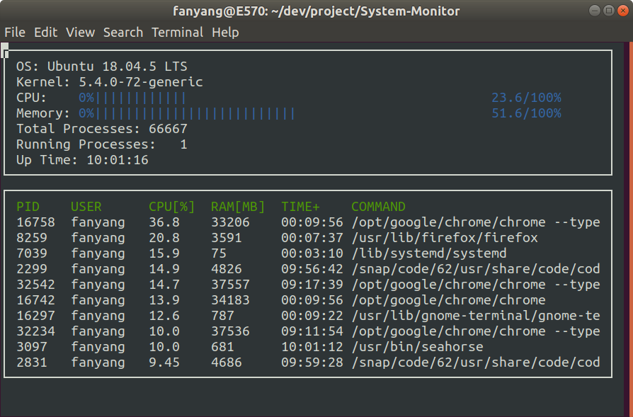

# System Monitor

In this project, I created a simple system monitor using c++. The system monitor shows the system information and processes information.

The information is obtained from files in linux system. The path of these directories are presented in the table below.

| Info | directory path  |
| :-----: | :-: |
| OS | `/etc/os-release` |
| Kernal    | `/proc/version` |
| CPU | `/proc/stat` |
| Memory | `/proc/meminfo`
| Total Processes | `/proc/stat`|
| Running Processes | `/proc/stat`|
| Up Time | `/proc/uptime` |

Note that the memory usage shown in this system monitor is non-cache/buffer memory.

The files for process information are located in `/proc/` directory. The PID is shown as the directory name in `/proc/`. 

| Info | directory path |
| :----: | :-: |
| USER | `/proc/[pid]/status`, `/etc/passwd`|
| CPU Usage | `/proc/[pid]/stat` |
| Memory Usaeg | `/proc/[pid]/status` |
| Up Time | `/proc/[pid]/stat` |
| Command | `/proc/[pid]/cmdline` |

## Compiling and Running

### Compiling

This project requires [ncurses](https://www.gnu.org/software/ncurses/) for displaying outputs. Install this library by command in terminal:
`sudo apt install libncurses5-dev libncursesw5-dev`.

After installation of dependencies, clone this project and create build directory in root of the project.
`mkdir build && cd build`.

Then run `cmake ..` and `make` in `build` directory. 

### Running

The executable is in `results/` directory. To run the system monitor, move to root directory of the project and run command:
`./results/monitor`.

## Credits

Starter code for System Monitor Project in the Object Oriented Programming Course of the [Udacity C++ Nanodegree Program](https://www.udacity.com/course/c-plus-plus-nanodegree--nd213).
